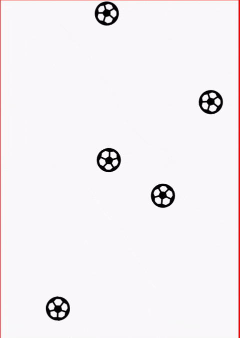

# Compose Game Engine

A simple 2D game engine built with Jetpack Compose. This library provides basic game engine functionality, including game object management, collision detection, and rendering. It utilizes compose Animatable and Canvas APIs. However, it is good for small games only.

## Features

- Add and manage game objects (round objects and boundaries for now)
- Start, pause, and stop the game loop
- Collision detection with customizable restitution
- Add gravity and acceleration
- Listener support for game events
- Rendering of game objects using Jetpack Compose

Feel free to experiment and add your own features.

## Installation
1. Add 'https://jitpack.io' to the ```settings.gradle``` file of your project. If you have configured your project such that all project level repositories are defined in the **project level ```build.gradle```** file, then, instead of adding it to the settings.gradle file, add it to the **project level build.gradle** file.

```groovy
// settings.gradle
dependencyResolutionManagement {
    repositoriesMode.set(RepositoriesMode.FAIL_ON_PROJECT_REPOS)
    repositories {
        google()
        mavenCentral()
        maven { url 'https://jitpack.io' } // add this
    }
}
```

2. Add the jitpack repository to your root gradle file and the dependency to your `build.gradle` file:

```groovy
allprojects {
    repositories {
        ...
        maven { url "https://jitpack.io" }
    }
}

dependencies {
    implementation 'com.github.vgupta98:compose-game:1.0.0'
}
```

## Usage

1. Create an instance of the GameEngine:
```kotlin
val gameEngine = GameFactory.getInstance()
```
2. Add round objects and boundaries to the game engine:
```kotlin
val roundObject = RoundObject(
    id = 1,
    initialPosition = Vector2D(100f, 100f),
    radius = 20f,
    mass = 1f,
    initialVelocity = Vector2D(1f, 1f),
    restitution = 0.8f
)

val boundary = Boundary(
    id = 2,
    startPosition = Vector2D(0f, 0f),
    endPosition = Vector2D(300f, 0f),
    restitution = 1f
)

gameEngine.addGameObject(roundObject)
gameEngine.addGameObject(boundary)
```
3. Start the game loop using a CoroutineScope:
```kotlin
val scope = CoroutineScope(Dispatchers.Main)
gameEngine.startGameLoop(scope)
```
4. Stop the game loop:
```kotlin
gameEngine.stopGameLoop(scope)
```
5. Use the `GameBoard` composable to render the game objects:
```kotlin
@Composable
fun MyGameScreen() {
    val gameResources = listOf(
        RoundObjectResource(
            id = 1,
            painter = rememberVectorPainter(image = Icons.Default.Circle)
        ),
        BoundaryResource(
            id = 2,
            color = Color.Black,
            thicknessInPx = 2f
        )
    )

    GameBoard(
        modifier = Modifier.fillMaxSize(),
        gameEngine = gameEngine,
        gameResources = gameResources,
        onDrawAbove = { /* Custom drawing above the game objects */ },
        onDrawBehind = { /* Custom drawing behind the game objects */ }
    )
}
```
6. Listening to collisions is also easy. Implement the GameListener interface to listen for collisions:
```kotlin
class MyGameListener : GameListener {
    override fun onCollision(objectId1: Int, objectId2: Int) {
        println("Collision between object $objectId1 and object $objectId2")
    }
}

val listener = MyGameListener()
gameEngine.addListener(listener)
```

Checkout the sample app included with this project for complete usage. Here is a preview of it:



## Contribution

Bug reports and pull requests are welcome. There is a lot room for optimizations and features!

## License

    Copyright (C) 2024 Vishal Gupta

    Licensed under the Apache License, Version 2.0 (the "License");
    you may not use this file except in compliance with the License.
    You may obtain a copy of the License at

       http://www.apache.org/licenses/LICENSE-2.0

    Unless required by applicable law or agreed to in writing, software
    distributed under the License is distributed on an "AS IS" BASIS,
    WITHOUT WARRANTIES OR CONDITIONS OF ANY KIND, either express or implied.
    See the License for the specific language governing permissions and
    limitations under the License.